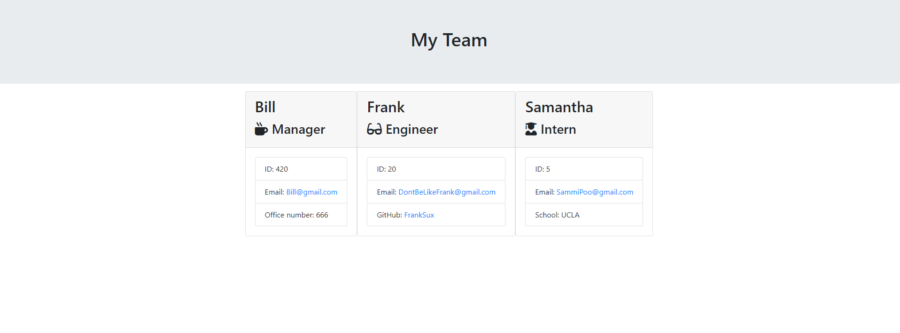

# Template Engine 

Template Engine is a nodeJS run program that will allow you to create a website for your team. You can have a team manager, an engineer, and an intern all from node JS. It will ask a few questions (some designed specifically for each role) and post that data into and html format.

This is not a deployed site.

Authored by [Zach LaFleur](https://github.com/MrCartree)